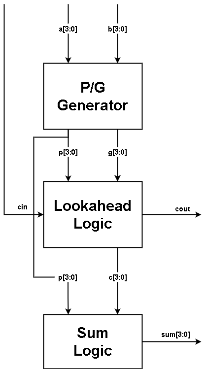
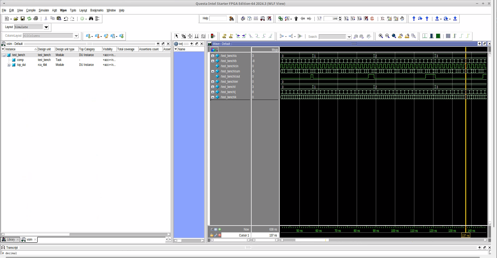
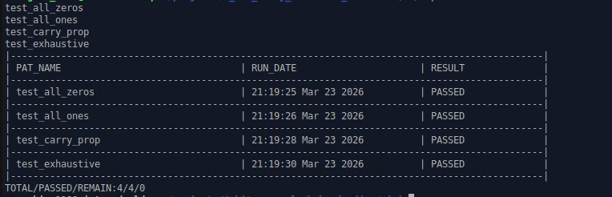
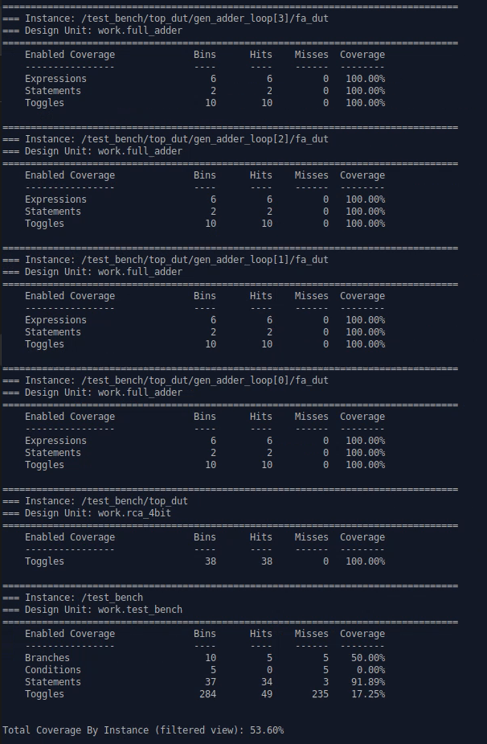

# 🚀 4-Bit Carry Lookahead Adder (CLA)

A 4-bit Carry Lookahead Adder (CLA) built from scratch using dataflow and structural modeling. I built this project as a direct upgrade to my previous Ripple Carry Adder (RCA) to solve the $O(N)$ propagation delay bottleneck. My main focus was on understanding parallel carry computation, loop unrolling in hardware synthesis, and resolving strict linter warnings while achieving 100% functional and code coverage.

### 📦 Technologies

* **RTL Design:** Verilog
* **Architecture:** Dataflow Modeling, Parallel Logic
* **Verification:** QuestaSim, ModelSim, Verilator (Linting)
* **Environment & OS:** Linux, VIM
* **Methodology:** Exhaustive Testing, Golden Model Self-Checking, Coverage-Driven Verification, Makefiles

### ⚙️ IP Features

Here's what makes this CLA block superior to a standard RCA:
* **$O(1)$ Propagation Delay:** Instead of waiting for the carry to ripple through each bit, this architecture computes all carry signals ($C_1$ to $C_4$) simultaneously in a single logic level.
* **P/G Generation:** Implements parallel `Generate` ($G_i = a_i \cdot b_i$) and `Propagate` ($P_i = a_i \oplus b_i$) signals for each bit.
* **Lookahead Logic (The "Brain"):** Utilizes complex Boolean algebra and algebraic substitution to anticipate carry bits based solely on $P$, $G$, and the initial $C_{in}$, completely eliminating the serial dependency.
* **Seamless I/O Compatibility:** Designed with the exact same port interface as an RCA, allowing for 100% testbench reusability.

### 📐 Hardware Specifications (Spec)

The 4-bit CLA is designed with the following port interfaces and functional constraints:

**1. Input/Output Ports:**

| Port Name | Direction | Width | Description |
| :--- | :--- | :--- | :--- |
| `a` | Input | 4-bit | First operand |
| `b` | Input | 4-bit | Second operand |
| `cin` | Input | 1-bit | Carry-in from a previous lower-order stage ($C_0$) |
| `sum` | Output | 4-bit | Result of the addition |
| `cout` | Output | 1-bit | Carry-out to a next higher-order stage ($C_4$) |

**2. Functional Description:**
* Computes the arithmetic sum: `Result = a + b + cin`.
* Core equations implemented strictly via combinational logic (no `+` operators):
  * $G_i = a_i \cdot b_i$
  * $P_i = a_i \oplus b_i$
  * $C_{i+1} = G_i + (P_i \cdot C_i)$
  * $S_i = P_i \oplus C_i$

**3. Architecture Block Diagram:**

  

**4. Module Descriptions:**

To implement the fast parallel carry architecture shown above, the design is hierarchically partitioned into three dedicated sub-modules and one top-level wrapper:
* **Sub-Module 1: P/G Generator (`pg_generator`)**
    * **Role:** The first stage of the dataflow. It computes the Propagate ($P$) and Generate ($G$) signals for all 4 bits simultaneously.
    * **Implementation:** Built using simple bitwise logic: $P_i = a_i \oplus b_i$ and $G_i = a_i \cdot b_i$. 
* **Sub-Module 2: Lookahead Logic (`lookahead_logic`)**
    * **Role:** The "Brain" of the CLA. It takes the $P$, $G$, and $cin$ signals to anticipate and calculate all internal carry bits ($C_1, C_2, C_3$) and the final $C_{out}$ in parallel, completely breaking the ripple dependency.
    * **Implementation:** Implemented using complex, unrolled Boolean equations ($C_{i+1} = G_i + (P_i \cdot C_i)$) modeled with continuous assignments.
* **Sub-Module 3: Sum Logic (`sum_logic`)**
    * **Role:** The final stage of the computation. It calculates the resulting sum bits.
    * **Implementation:** Simply XORs the Propagate signals with the pre-calculated Carry signals from the Lookahead block: $S_i = P_i \oplus C_i$.
* **Top Module: 4-Bit CLA Top (`cla_4bit`)**
    * **Role:** The structural wrapper (Motherboard) that stitches the three stages together.
    * **Implementation:** Contains no logic equations itself. It only declares the internal buses (`p[3:0]`, `g[3:0]`, `c[3:0]`) and routes the dataflow strictly from top to bottom (Inputs $\rightarrow$ P/G Generator $\rightarrow$ Lookahead Logic $\rightarrow$ Sum Logic $\rightarrow$ Outputs).

### 🦉 The Process

I started by designing the hardware architecture, breaking the CLA down into three distinct tiers: the **P/G Generator**, the **Carry Lookahead Logic (CLG)**, and the **Sum Logic**. 

Writing the RTL for the Lookahead Logic was the most challenging part. I utilized `generate` `for` blocks to dynamically instantiate the logic gates. During this phase, I encountered strict linting errors from **Verilator** regarding circular combinational logic (`UNOPTFLAT`) and unnamed generate blocks (`GENUNNAMED`). I successfully resolved these by properly applying `lint_off`/`lint_on` directives for expected hardware loops and adding explicit labels to all `begin...end` structural blocks.

For verification, I capitalized on the identical I/O interface between the RCA and CLA. I reused my highly reliable **Self-Checking Testbench** and Golden Model (`a + b + cin`). 

Executing my Linux `Makefile` automated the exhaustive injection of all 512 possible input combinations. The DUT passed flawlessly with zero mismatches, once again hitting the golden metric of 100% Code Coverage.

### 📚 What I Learned

During this project, I significantly leveled up my IC design knowledge:
* **Speed vs. Area Trade-off:** I practically experienced how hardware design trades silicon area (larger, more complex AND/OR gate arrays for the Lookahead Logic) to achieve massive gains in computational speed.
* **Linter Warnings & Coding Standards:** I learned how to debug and resolve strict Verilator linter warnings (`UNOPTFLAT`, `GENUNNAMED`), improving my RTL coding style to meet professional industry standards.
* **Testbench Reusability:** I realized the power of standardizing I/O interfaces, allowing me to plug a completely different internal architecture into an existing verification environment without changing a single line of testbench code.

### 📋 Verification Plan (VPLAN) Summary

*(Reused from the RCA project due to identical functionality but fundamentally different internal architecture)*

| Item | Sub Item | Method | Pass Condition | Result |
| :--- | :--- | :--- | :--- | :--- |
| **Basic Addition** | `test_all_zeros` | Direct Stimulus | `{cout, sum} == 5'b00000` | ✅ PASS |
| **Max Values** | `test_all_ones` | Direct Stimulus | `{cout, sum} == 5'b11111` | ✅ PASS |
| **Carry Logic** | `test_carry_prop` | Direct Stimulus | Carry bit anticipates correctly across all stages | ✅ PASS |
| **Full Space** | `test_exhaustive` | Nested Loops | DUT output strictly matches `(a + b + cin)` across all 512 cases | ✅ PASS |

### 📊 Verification Results & Artifacts

1. **Simulation Regression Log**

  

2. **Regression Test Report**

  

3. **Code Coverage Report (100%)**

  

### 💭 How can it be improved?

* **Hierarchical CLA:** Cascade multiple 4-bit CLA blocks to build a 16-bit or 32-bit Adder using a higher-level Block Carry Lookahead Generator (BCLG).
* Compare the actual synthesis gate-level netlist and timing reports (using tools like Design Compiler or Yosys) between this CLA and the previous RCA to mathematically quantify the delay reduction and area increase.
